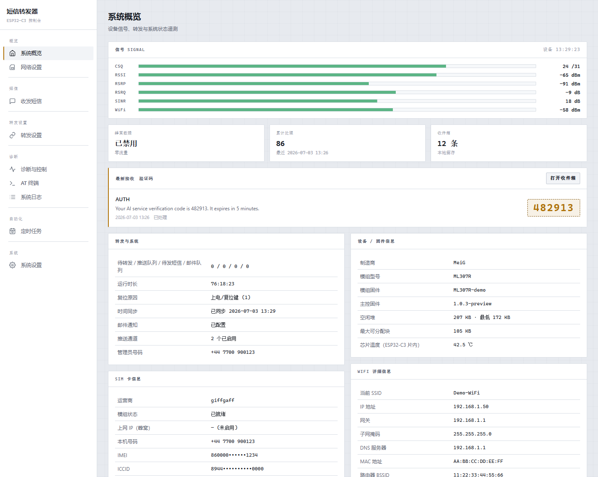
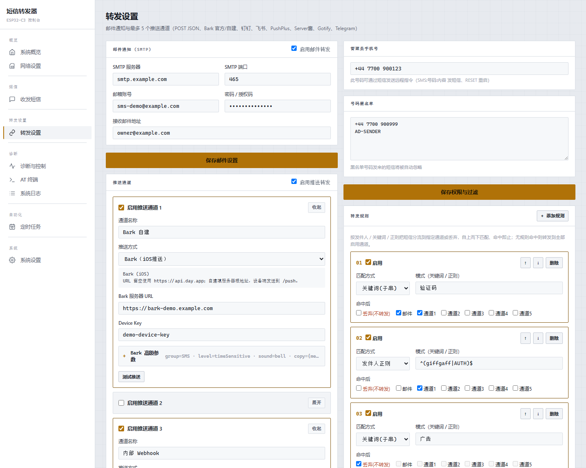
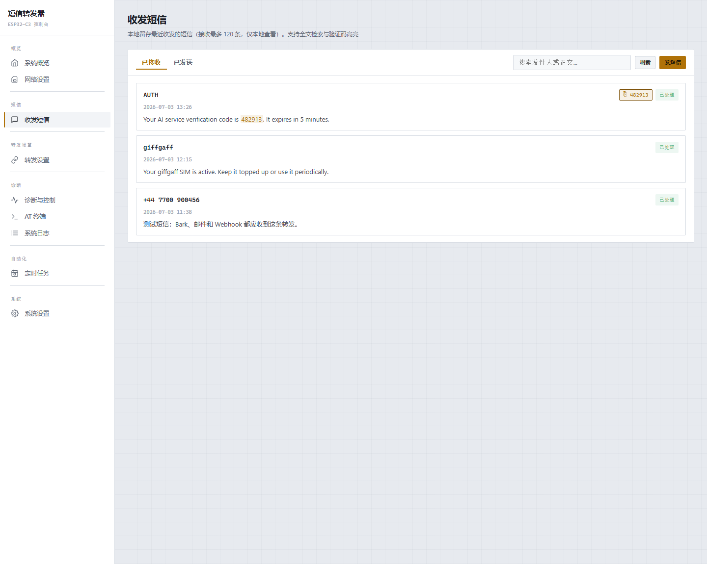
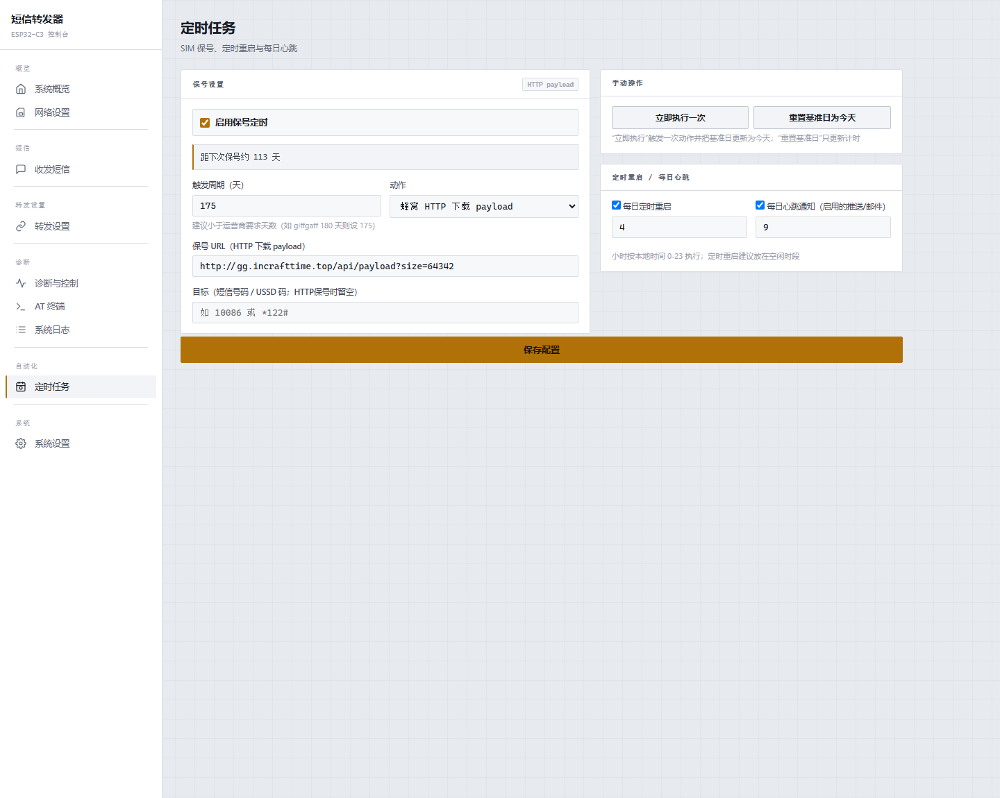
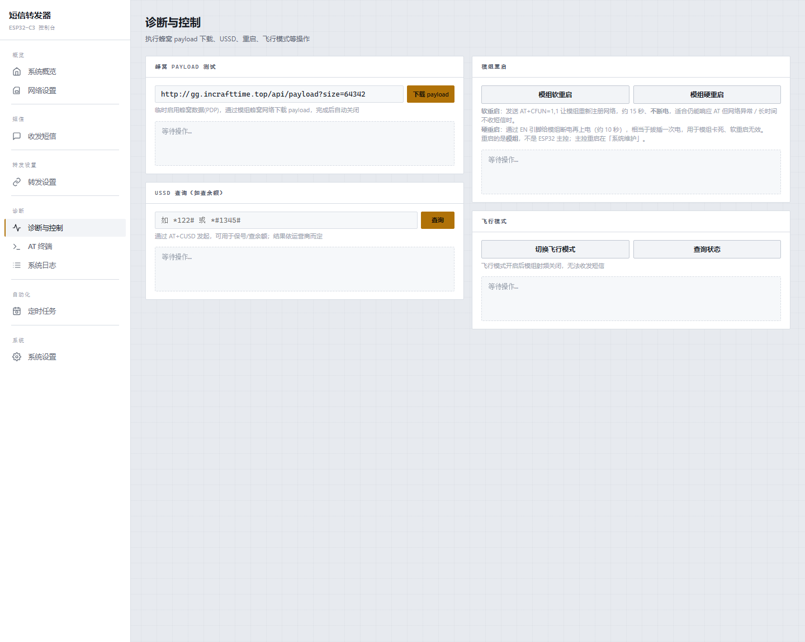
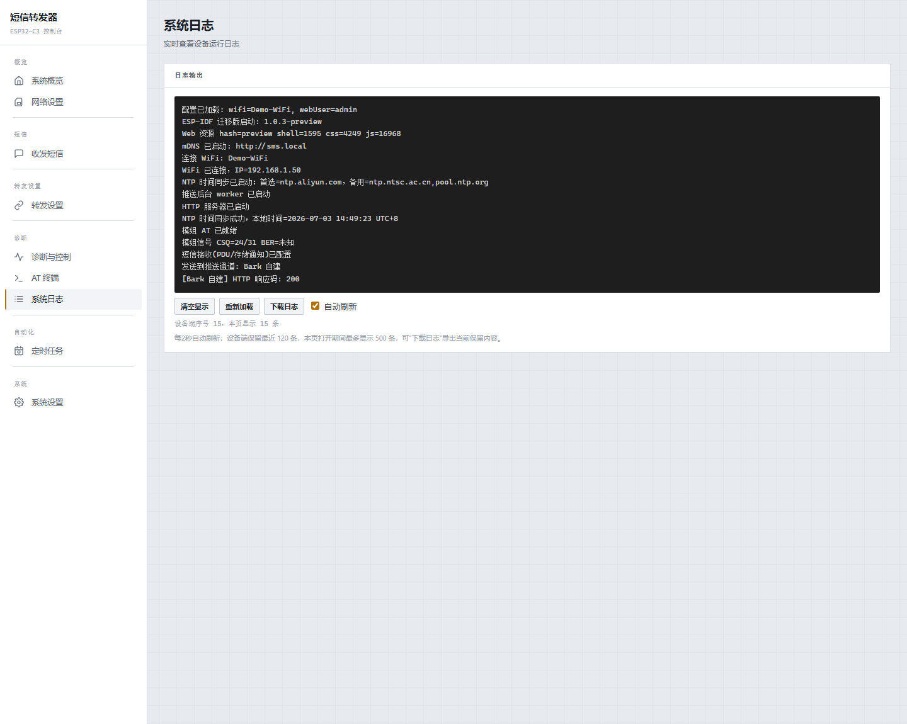

# SMS Forwarding ESP-IDF 固件

ESP32-C3 + ML307 系列 4G/LTE 模组的短信转发固件。设备通过 UART/AT 接收 PDU 短信，解码后经 WiFi 转发到邮件和最多 5 个推送通道，并提供 Web UI 做配置、诊断、日志、OTA 和保号任务。

本仓库现在只保留 **原生 ESP-IDF** 固件；Arduino fallback 已移除。

## 功能

- PDU 短信接收，支持中文短信和长短信合并。
- `+CMT` URC 与 `AT+CMGL` 存储轮询双路径接收，去重后转发。
- 邮件 SMTP、POST JSON、Bark（官方/自建）、GET、钉钉、PushPlus、Server酱、自定义模板、飞书、Gotify、Telegram。
- 推送/邮件后台 worker、失败重试、通道冷却，避免阻塞短信接收和 Web UI。
- Web UI：配置、收件箱、日志、AT 终端、WiFi 配网、OTA、状态面板、保号任务。
- NVS 持久化配置，支持 SoftAP 配网与 `sms.local` mDNS。
- 蜂窝 HTTP/SMS/USSD 保号动作，默认转发仍走 WiFi，不消耗蜂窝流量。

## Web UI 预览

以下截图由 `preview/build_preview.py` 基于当前 `code/web_src/` 生成，所有号码、邮箱、Device Key、IMEI/ICCID/IMSI 均为 mock 示例数据，不包含真实设备信息。

```powershell
python preview\build_preview.py
start preview\index.html
```

| 系统概览 | 转发设置 |
| --- | --- |
|  |  |

| 收发短信 | 定时任务 |
| --- | --- |
|  |  |

| 诊断与控制 | 系统日志 |
| --- | --- |
|  |  |

## 构建与烧录

本机推荐使用封装脚本：

```powershell
powershell -ExecutionPolicy Bypass -File tools\idf.ps1 build
powershell -ExecutionPolicy Bypass -File tools\idf.ps1 flash -Port COM5
powershell -ExecutionPolicy Bypass -File tools\idf.ps1 monitor -Port COM5
```

Web UI 修改后先生成资源：

```powershell
python tools\build_web_assets.py
python tools\build_web_assets.py --check
```

CI 使用 `.github/workflows/build.yml` 构建 ESP-IDF 固件。

## Bark 推送

推送方式选择 `Bark（iOS推送）` 后：

- `Bark 服务器 URL` 留空使用 `https://api.day.app`；自建服务填服务器根地址，例如 `https://bark.example.com` 或 `http://192.168.1.10:8080`，固件会发送到 `/push`。
- `Device Key` 填 Bark App 中显示的 key；兼容旧配置里直接填写 `https://api.day.app/<key>` 的方式。
- `可选参数` 使用 URL query 风格，例如 `group=SMS&sound=bell&level=timeSensitive&icon=https%3A%2F%2Fexample.com%2Ficon.png`；支持 Bark 的 `subtitle`、`level`、`badge`、`sound`、`group`、`icon`、`url`、`copy`、`isArchive` 等参数。

## 首次使用

1. 烧录后设备会优先使用 NVS 中保存的 WiFi。
2. 如果没有 WiFi 或连接失败，会开启开放配网热点 `SMS-Forwarder-XXXX`。
3. 连接热点后访问 `http://192.168.1.1` 配置 WiFi。
4. 连接路由器后可通过设备 IP 或 `http://sms.local` 访问 Web UI。
5. 默认 Web 账号密码为 `admin` / `admin123`，首次使用请立即修改。

可选：本地创建 `code/wifi_config.h` 作为出厂 WiFi seed（该文件被 `.gitignore` 忽略）：

```cpp
#define WIFI_SSID "your-wifi"
#define WIFI_PASS "your-password"
```

也可以留空，完全走 Web 配网。

## 硬件接线

ESP32-C3 Super Mini 与 ML307x-DC UART 连接：

```text
ESP32-C3 GPIO5  -> ML307 EN
ESP32-C3 GPIO3  -> ML307 RX
ESP32-C3 GPIO4  -> ML307 TX
ESP32-C3 GND    -> ML307 GND
ESP32-C3 5V     -> ML307 VCC
```

默认引脚定义在 ESP-IDF 模组组件中：TXD=GPIO3，RXD=GPIO4，MODEM_EN=GPIO5，LED=GPIO8。

## 开发入口

- `main/`：ESP-IDF app entry。
- `components/idf_*`：配置、WiFi、Web、模组、短信、推送、日志、收件箱。
- `components/web_assets`：打包后的 Web 静态资源组件。
- `code/web_src/`：可编辑 Web UI 源。
- `code/web_assets.*`：生成文件，不手改。
- `dev_doc/`：架构和迁移说明。

更多工程约定见 `AGENTS.md`。
